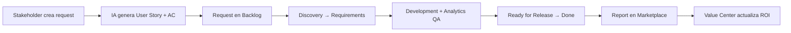

# Analytics Command Center — Arquitectura

Plataforma interna enterprise para colaboración entre Analytics, Product, Marketing, Engineering y Liderazgo. Diseñada para una aerolínea global.

## Visión del producto

**No es un sistema de tickets.** Es un command center que combina:

| Inspiración | Función en ACC |
|-------------|----------------|
| Linear | Delivery Board, sprints, story points |
| Notion / Confluence | Knowledge Hub, documentación versionada |
| Amplitude / Mixpanel | Event Catalog, Data Dictionary |
| Looker | Report Marketplace, dashboards embebidos |
| ChatGPT | Discovery Assistant + AI Copilot |

## Stack

```
┌─────────────────────────────────────────────────────────────┐
│  Vercel — Next.js 15 App Router + React + TypeScript        │
│  TailwindCSS · shadcn/ui · Framer Motion · @dnd-kit         │
└──────────────────────────┬──────────────────────────────────┘
                           │
┌──────────────────────────▼──────────────────────────────────┐
│  Supabase — Auth · PostgreSQL · Storage · RLS               │
└──────────────────────────┬──────────────────────────────────┘
                           │
┌──────────────────────────▼──────────────────────────────────┐
│  FastAPI (Python) — OpenAI · /chat · /generate-request      │
└─────────────────────────────────────────────────────────────┘
                           │
┌──────────────────────────▼──────────────────────────────────┐
│  GA4 · GTM · BigQuery · Looker Studio (integraciones)        │
└─────────────────────────────────────────────────────────────┘
```

## Módulos (12)

| # | Ruta | Módulo |
|---|------|--------|
| 1 | `/command-center/executive` | Executive Dashboard |
| 2 | `/command-center/requests` | Analytics Request Center |
| 3 | `/command-center/board` | Analytics Delivery Board |
| 4 | `/command-center/reports` | Report Marketplace |
| 5 | `/command-center/discovery` | Report Discovery Assistant |
| 6 | `/command-center/events` | Event Catalog |
| 7 | `/command-center/dictionary` | Data Dictionary |
| 8 | `/command-center/knowledge` | Knowledge Hub |
| 9 | `/command-center/copilot` | AI Analytics Copilot |
| 10 | `/command-center/maturity` | Analytics Maturity Center |
| 11 | `/command-center/value` | Analytics Value Center |
| 12 | `/command-center/workspace` | My Workspace |

## Roles y permisos

| Rol | Acceso |
|-----|--------|
| `analytics_lead` | Full admin ACC |
| `analytics_consultant` | Gestión requests, board, reports |
| `manager` / `director` | Crear requests, ver executive |
| `product_owner` | Crear requests, ver reports |
| `developer` | Editar board, ver events |
| `qa` | QA checklists, ver events |
| `read_only` | Solo lectura |

RLS en PostgreSQL via funciones: `is_analytics_team()`, `can_manage_requests()`, `can_edit_board()`.

## Esquema de base de datos

Migraciones en `supabase/migrations/`:

- `001_initial_schema.sql` — Portal base (profiles, requests, playbooks, articles, event_catalog)
- `002_seed_data.sql` — Datos demo portal
- `003_command_center_schema.sql` — Tablas ACC (reports, metrics, sprints, analytics_health, etc.)
- `004_command_center_seed.sql` — Seed reports, metrics, maturity scores

### Tablas principales ACC

```
profiles (+ acc_role, department, team)
requests (+ business_goal, delivery_status, ai_*, story_points, sprint_id)
attachments · sprints · stories · tasks
reports · report_categories · metrics · dimensions
event_parameters · analytics_scores · analytics_health
activity_logs · notifications · copilot_sessions
```

## API Routes (Next.js)

| Endpoint | Método | Descripción |
|----------|--------|-------------|
| `/api/command-center/requests` | POST | Crear solicitud + artefactos IA |
| `/api/command-center/generate-request` | POST | Generar user story, AC, measurement plan |
| `/api/command-center/chat` | POST | Discovery + Copilot chat |
| `/api/command-center/board/[id]` | PATCH | Actualizar delivery_status (Kanban) |

## FastAPI (`services/ai-analyzer`)

| Endpoint | Descripción |
|----------|-------------|
| `GET /health` | Health check |
| `POST /analyze` | Análisis CSV/XLSX |
| `POST /chat` | Copilot / Discovery |
| `POST /generate-request` | Artefactos de solicitud |

## Estructura de carpetas

```
src/
├── app/
│   ├── command-center/          # 12 módulos ACC
│   │   ├── layout.tsx           # Sidebar + shell
│   │   ├── executive/
│   │   ├── requests/
│   │   ├── board/
│   │   └── ...
│   └── api/command-center/      # API routes
├── components/command-center/   # Sidebar, Kanban, Chat, StatCard
├── types/command-center.ts      # Tipos ACC
└── lib/supabase/                # Clientes Supabase

services/ai-analyzer/            # FastAPI + OpenAI
supabase/migrations/             # Schema SQL + RLS
docs/COMMAND_CENTER.md           # Este documento
```

## UX Flow — Solicitud end-to-end



## Deployment

1. **Vercel** — Next.js con env vars: `NEXT_PUBLIC_SUPABASE_*`, `AI_SERVICE_URL`, `OPENAI_API_KEY`
2. **Supabase** — Aplicar migraciones 001–004, configurar Auth, Storage bucket `analytics-uploads`
3. **FastAPI** — Railway/Render/Fly.io en `AI_SERVICE_URL`

### Auth setup

Tras crear usuario en Supabase Auth:

```sql
UPDATE profiles
SET role = 'admin', acc_role = 'analytics_lead'
WHERE email = 'tu@email.com';
```

## Acceso

- URL: `/command-center/executive` (requiere login)
- Middleware protege `/command-center/*`
- Link en header público: **Command Center**
